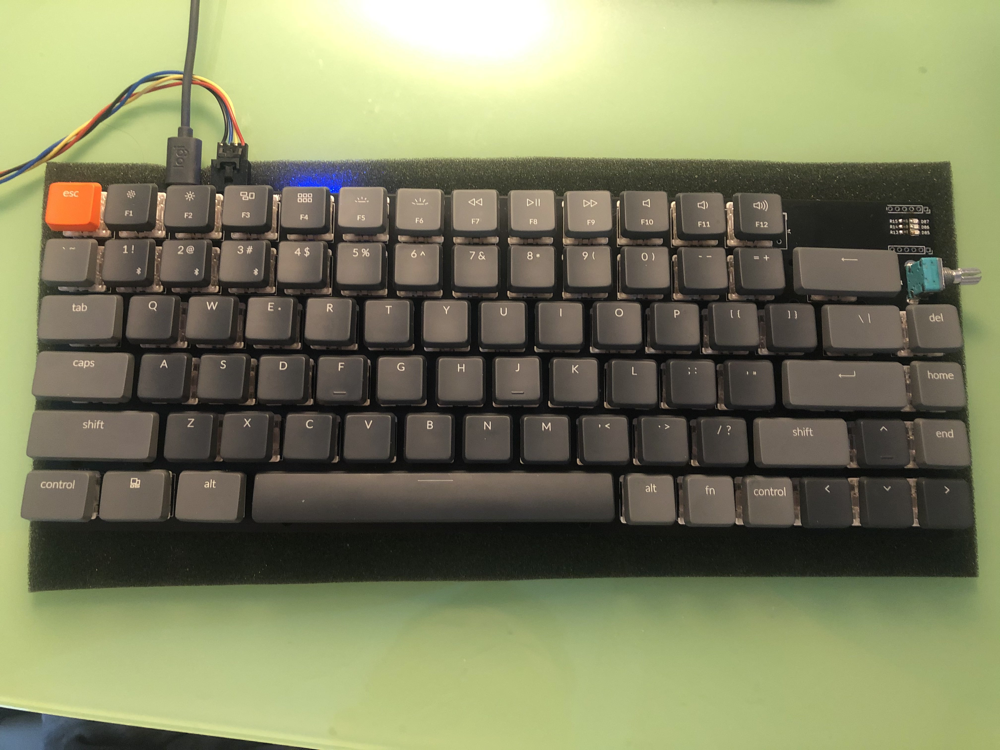

# STM32 Keyboard

HKUST Elec3300 project

## Features
* 6*14 key matrix
* Programmable 6*14 RGB matrix
* On-board OLED display(SSD1306)
* Volume control by Rotary encoder
* Fingerprint sensor
* Programmable Macro
* Sleep Mode(low power mode)
* Connection:
    * Bluetooth
    * USB
* Power:
    * USB power supply
    * Battery(with USB charging)

## Final View

## PCB
TODO
## Progress record and future plan
https://github.com/Harrisonust/STM32Keyboard/projects/1

## Video Demo on Youtube
https://www.youtube.com/watch?v=Xp9VSN2TY44
