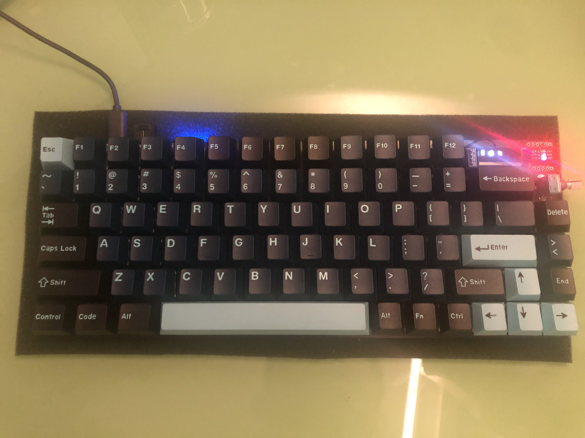

# STM32 Keyboard
[](https://youtu.be/Xp9VSN2TY44)

HKUST Elec3300 project

## Features
* 6*14 key matrix
* Programmable 6*14 RGB matrix
* On-board OLED display(SSD1306)
* Volume control by Rotary encoder
* Fingerprint sensor
* Programmable Macro
* Sleep Mode(low power mode)
* Connection:
    * Bluetooth
    * USB
* Power:
    * USB power supply
    * Battery(with USB charging)



## Environment
Download all of these before continuing:

- [arm-none-eabi-gcc](https://developer.arm.com/tools-and-software/open-source-software/developer-tools/gnu-toolchain/gnu-rm/downloads) for compiling (make sure you use the lastest version)
- [OpenOCD](https://github.com/xpack-dev-tools/openocd-xpack/releases/) for flashing and debugging
- [CMake](https://cmake.org/download/) for the build system
- [Ninja](https://ninja-build.org/) or some kind of Make
	- Ninja is faster and easier to install on windows
	- Mac/Linux can just use inbuilt Make easily
### Package Manager: Use Brew on Mac

https://brew.sh/

```
brew install --cask gcc-arm-embedded
brew install ninja
brew install cmake
brew install open-ocd
```

### Package Manager: Use Anaconda

https://anaconda.org/
While Anaconda is usually for handling Python packages you can find many. You may need this anyway

```
conda install -c conda-forge cmake ninja 
conda install -c litex-hub openocd # max/linux
conda install -c m-labs openocd # windows/linux
conda install -c dhgoldberg gcc-arm-none-eabi
```

### Package Manager: Use Chocolatey on Windows

https://chocolatey.org/

```
choco install gcc-arm-embedded
choco install openocd
choco install ninja
choco install cmake
```
## Building and Flashing:
In the command palette
- type `build` and find `CMake: Build`, remember the keyboard shortcut shown on the right for future use
- use `CMake: Build Target` and choose `flash`
- use `CMake: Set Build Target` to choose the default build target
    - this would make `CMake: Build` run that target
    - the default default build target is `all` which just compiles

## PCB
TODO
## Progress record and future plan
https://github.com/Harrisonust/STM32Keyboard/projects/1

## Video Demo on Youtube
https://www.youtube.com/watch?v=Xp9VSN2TY44
