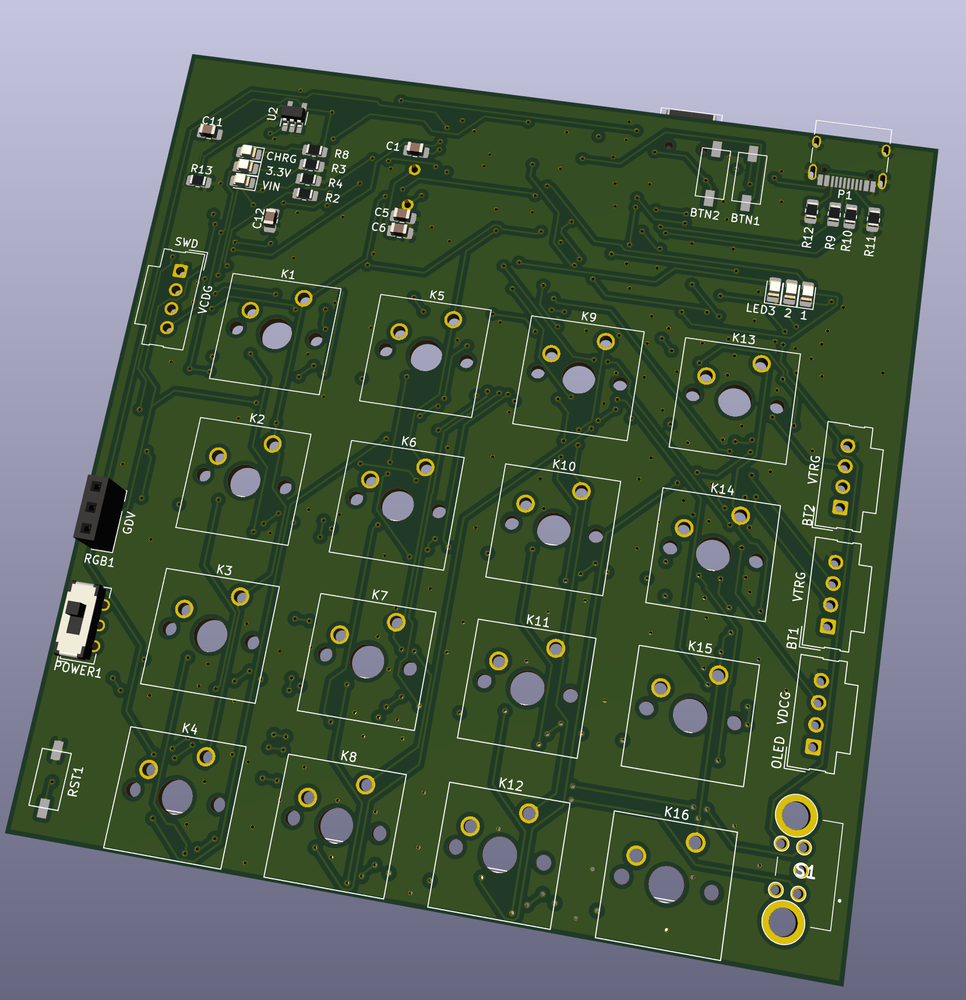
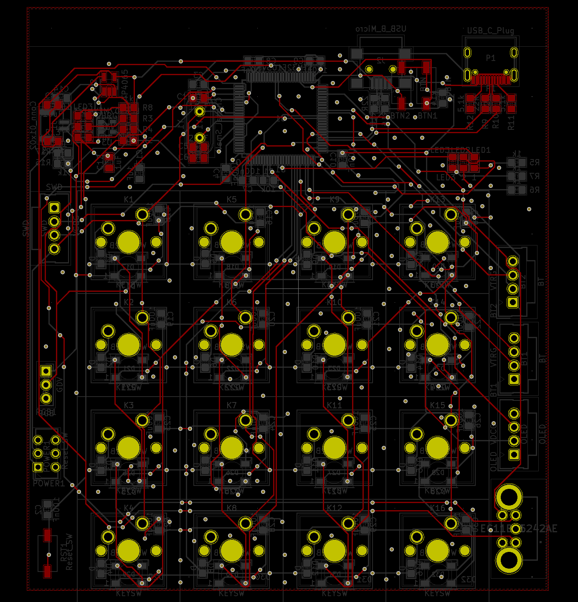
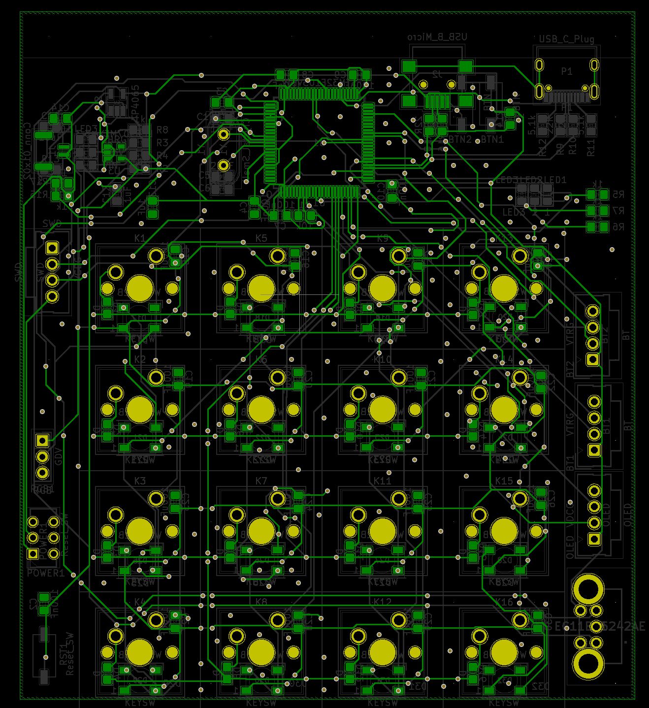

# STM32 Keyboard

## Features
* 4x4 keypad
* Programmable 4x4 RGB matrix
* On-board OLED display
* Volume control by Rotary encoder
* Fingerprint sensor
* Programmable Macro
* Sleep Mode(low power mode)
* Connection:
    * Bluetooth connection
    * USB connection
* Power:
    * USB power supply
    * Battery(with USB charging)

## Final View

## PCB
3D Front View

3D Back View

PCB Front View

PCB Back View

